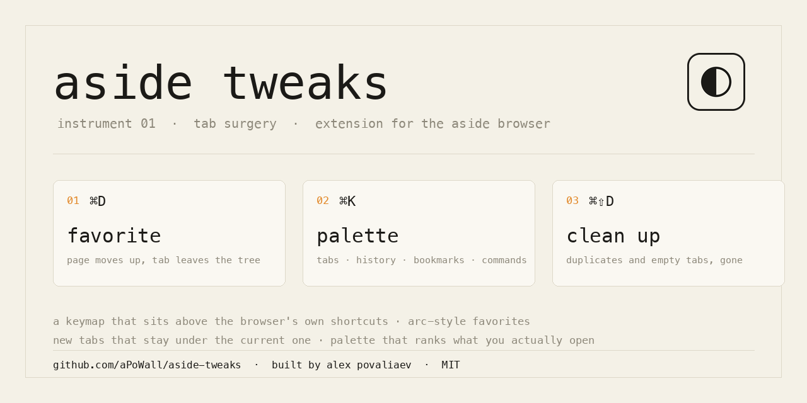

# Aside Tweaks



A small extension for the [Aside](https://aside.com) browser: a command palette, a keymap that
sits **above** the browser's own shortcuts, Arc-style pins, duplicate cleanup and tab placement
that actually holds.

Built by [Alex Povaliaev](https://github.com/aPoWall) for daily use, kept in the open.

## Why it exists

Aside is a Chromium browser with an AI agent bolted into the sidebar, and the parts it inherits
from Chromium behave like Chromium: new tabs land at the top of the list, `⌘D` opens a bookmark
dialog nobody asked for, duplicates pile up, empty new tabs accumulate, and there is no way to
re-bind any of it from inside the browser.

Three things follow from that, and each one is a feature here.

**A tab list is not a filing cabinet.** Arc taught a generation of users that the page you keep
belongs *above* the churn — one keystroke moves it up and it stops competing with the twenty tabs
you opened this hour. Chromium's pin does half of that; it keeps the tab alive in the strip but
never lets it leave the tree. So `⌘D` here writes the page into the bookmarks bar as its last row
and moves the tab down out of the way — without closing it. Closing would wake a sleeping neighbour,
that neighbour reloads, and the whole gesture reads as «the browser took me somewhere». Press `⌘D`
again on the same page: the bookmark goes and the tab comes back to the very top of the list.

**Shortcuts should belong to the person, not to the vendor.** Chromium lets an extension declare
four shortcuts and re-bind them only on its own settings page. This extension listens in the
capture phase on the page instead, which arrives *before* the browser applies its accelerator —
so any combo the page can see becomes bindable, `⌘D` and `⌘⇧D` included. Combos are stored by
physical key code, so switching to a non-Latin layout doesn't silently break them.

**Search beats navigation.** With fifty tabs open, hunting the sidebar is slower than typing.
The palette ranks by what you actually pick — frequency with a two-week decay — collapses history
by normalised url so one site can't flood the list, and takes a pasted address straight into a
named block.

Everything else is repair work: a placement guard that holds a new tab under the current one while
the browser re-orders it, cleanup that also collects the empty new tabs, groups that open expanded
instead of collapsed.

## Install

```bash
git clone https://github.com/aPoWall/aside-tweaks.git
```

`chrome://extensions` → enable Developer mode → **Load unpacked** → pick the folder.
Chromium 114+ (Aside is built on 151), Manifest V3.

## What it does

**Palette — ⇧⌘K.** A layer over the page, not a second window: the page behind it darkens and
blurs, the palette casts a large shadow, and there is no title bar and no traffic lights to
mistake it for something you have to manage. It is an extension document inside a shadow-root
frame, so it keeps full access to tabs, history and bookmarks while it sits on the page. Where no
page exists — `chrome://`, a new tab, Aside's own interface — or where the site's security policy
refuses foreign frames, it falls back to a centred window automatically. `⇥` switches scope:
`all · tabs · history · bookmarks · commands`.

- history collapses by normalised url (utm stripped), so one site stops eating the whole list
- ranking by pick frequency with a two-week decay, `n · e^(−days/14)`
- paste a url and you get `Open`, `Open in block · <name>`, `Open pinned`
- `⇧↵` is the row's second action: pin the tab, or open the address already pinned
- arithmetic in the input (`2+2`, `(19*3)/2`), `↵` copies the result

**Blocks by meaning — opt-in.** A site is a weak signal: fifteen tabs on one `github.com` say nothing
about what you are doing. This hands the **titles and hosts** of the open tabs to a model through
OpenRouter and asks for working blocks. Page contents, cookies and full addresses never leave the
machine, the key lives in local storage and never syncs, and the answer arrives as a **proposal in a
small window** — nothing is regrouped until you press apply. Off until you paste a key in settings
card 07; network access to `openrouter.ai` is an optional permission requested at that moment, not
held in advance.

**One list of commands.** `commands.js` holds every command with its title, glyph, key and
one-line explanation; the palette and the panel render from it. Adding a command in one place
adds it everywhere, and the names cannot drift apart between surfaces.

**Own keymap.** Every action is bindable inside the extension, and the binding wins over the
browser's: keydown reaches the page in the capture phase *before* the browser applies its
accelerator, so `preventDefault()` takes over `⌘D`, `⌘⇧D`, `⌘S`, `⌘P`. Combos are stored by
`event.code`, not `event.key` — a non-Latin keyboard layout doesn't break them.

Defaults: `⌘D` bookmark ⇄ tab · `⇧⌘D` pin · `⌥⌘D` clean up · `⌥⌘T` tidy up.
Native fallbacks: `⌃D` pin, `⌃⇧D` clean, `⌃⇧S` panel, `⇧⌘K` palette.

Two levels hold keys, and only one of them is ours. The page-level keymap above is stored by the
extension and can be rebound freely. The browser-level commands live in `chrome://extensions/shortcuts`;
a manifest can *suggest* them but nothing in the extension can rebind or clear them — which is why a
key that keeps firing an old action is set there, not here. Settings card 01 lists both, the browser's
side read live from `chrome.commands.getAll()`.

**Bookmark ⇄ tab — ⌘D.** The current page becomes the *last* row of the bookmarks bar; the tab
stays open, loaded and active, and slides to the end of the list. Press it again on the same page
and it reverses: the bookmark is removed and the tab returns to the very top, right under the pinned
squares. Nothing is ever closed, so nothing reloads. No dedicated folder — the bar itself is the
destination. A tab inside a group is never pulled out of its block; turn *the tab moves along with
the bookmark* off in settings if you want the bookmark alone to change.

**Pins, Arc-style.** A pin moves the tab into the squares on top of the sidebar. Closing a pinned
tab brings the pin back asleep instead of dropping it; to remove it, unpin first. A pin is not a
bookmark — bookmarking is a separate action that writes to the bookmarks bar with no dialog and
toggles off on a second call.

**Cleanup.** Auto-dedupe closes a fresh tab when the same url is already open and switches to the
existing one. The manual command clears every empty new tab as well, leaving a window its last tab
so it never closes itself.

**Placement.** New tabs open under the current one. Aside re-orders a fresh tab *after* it is
created, so a guard keeps putting it back until it stops drifting (window configurable, 2.5 s by
default). Other modes: at the end of the list, or leave it to the browser.

**Panel — ⌃⇧S.** Own side panel via `chrome.sidePanel`, four numbered sections: the top of the
bookmarks bar, pinned tabs, the rest grouped by blocks, commands. Rows carry three actions on hover — move up to
favorites, pin, close — and drag reorders the window.

**Blocks.** A block is a name plus substrings. Blocks drive tab grouping, the palette's
«open in block» and the panel's sections. Groups are created expanded.

## The behaviour contract

Written down because these were asked for one by one and each is easy to break by accident.

| Gesture | What must happen |
|---|---|
| `⌘D` on a fresh page | bookmark appended as the **last** row of the bar; the tab stays open, loaded, **selected**, and moves to the **first row of the tabs** |
| `⌘D` again on the same page | bookmark removed; the tab stays at the first row, still selected |
| either direction | the page always ends up **at the top**, never at the bottom — the sidebar scrolls up to it, the way pinning already behaves |
| `⇧⌘D` on an ordinary tab | pinned into the squares on top of the sidebar |
| `⇧⌘D` on a pinned tab | unpinned **and** moved to the first row of the tabs, and it stays the selected tab |
| any of the above | nothing is ever closed, so no sleeping neighbour wakes up and reloads |
| a tab inside a group | never pulled out of its block by these gestures |
| the same key from two levels | a repeat within 450 ms is swallowed, so a page-level and a browser-level binding on one combo cannot toggle twice |
| opening a duplicate | a note on the page, nothing closed — cleaning is a command you run |
| ordering / grouping | always acts on the last **normal** window, even when the palette window was focused last |
| every command | present in both the palette and the panel with the same name |
| the model | proposes, never applies — and only sees titles and hosts |

## Tests

```bash
node tests/sw-smoke.mjs
```

The service worker is loaded into a stubbed `chrome` and driven the way the popup drives it:
placement of a fresh tab under the active one, the tidy sweep, pin and unpin, the bookmark toggle
in both directions, the repeat guard, and ordering while a popup window was the last focused one. It
exists because a silent `ReferenceError` at load makes every feature look broken at once —
the worker dies, nothing registers, and the UI just stops answering.

## Limits worth knowing

**Aside's own `✦ Tidy` cannot be triggered from here.** It is a button in the browser's native
sidebar: no menu command, no URL scheme (`Info.plist` registers only http, https and file), and
the window reports **zero elements** to macOS Accessibility, so there is nothing to click by
script either. `⌥⌘T` is our own sweep — deterministic, four steps, one report.

**The layer covers the page, not the browser.** A page-level overlay cannot darken the sidebar or
the toolbar; no extension can draw over browser chrome. What it can do is own the page area
completely, which is what makes it read as a field rather than a window.

**`⌘T ⌘W ⌘N ⌘Q ⌘M ⇧⌘W` cannot be taken over by any extension** — the browser consumes them before
the page exists. On `chrome://` pages, the new tab and inside Aside's own interface there is no page
at all, so only native shortcuts fire there. Every extension that promises custom shortcuts
(Shortkeys included) has exactly this ceiling.

The layer above is macOS itself: menu commands can be re-bound per app, which is what
System Settings → Keyboard → Keyboard Shortcuts → App Shortcuts does. To free `⌘D` from the native
bookmark dialog:

```bash
defaults write at.studio.AsideBrowser NSUserKeyEquivalents \
  -dict-add "Bookmark This Tab…" "^@b"
```

Restart the browser afterwards; `@` is ⌘, `^` is ⌃, `~` is ⌥, `$` is ⇧. The two that matter for
this extension:

```bash
defaults write at.studio.AsideBrowser NSUserKeyEquivalents -dict-add "Bookmark This Tab…" "^@b"
defaults write at.studio.AsideBrowser NSUserKeyEquivalents -dict-add "Bookmark All Tabs…" "^@\$b"
```

The repo ships this as a script — `scripts/native-shortcuts.sh` applies the whole table,
`--reset` puts the stock keys back:

| menu item | new binding | frees |
|-----------|-------------|-------|
| `Bookmark This Tab…` | `⌃⌘B` | `⌘D` |
| `Bookmark All Tabs…` | `⌃⇧⌘B` | `⇧⌘D` |
| `Always Show Bookmarks Bar` | `⌥⇧⌘B` | `⇧⌘B` |

Menus build their key equivalents at launch, so nothing changes until the browser is quit and
reopened — the menu keeps showing the old keys in the meantime, which looks like the write failed.
It didn't; check with `defaults read at.studio.AsideBrowser NSUserKeyEquivalents`.

Menu titles are exact strings — read them with
`osascript -e 'tell application "System Events" to tell process "Aside" to get name of menu items of menu 1 of menu bar item "Bookmarks" of menu bar 1'`.

Two things this cannot reach: Aside registers no custom url scheme (only `http`, `https`, `file`),
so nothing outside the browser can hand a prompt to its agent; and the sidebar's **Tidy** button is
not a menu command, so macOS has no handle to bind it to.

**Aside's own sidebar cannot be repainted or restyled by an extension.** It is native browser
chrome: colours come from internal palette ids (`kColorAsideFloatingSidebarBackground`,
`kColorAsideSidebarItemBackgroundHover`), and its preferences expose width, expand-on-hover and
sections — no colour key at all. The browser theme paints the toolbar and leaves the sidebar alone.
Everything this extension draws is themable instead: palette, popup, settings, panel.

## Layout

| file | role |
|------|------|
| `background.js` | service worker: placement, dedupe, pins, groups, palette window, omnibox `tw` |
| `keys.js` | content script: the keymap over the browser's shortcuts, plus on-page toasts |
| `palette.js` / `.html` | the ⇧⌘K palette, as a layer or as a window |
| `commands.js` | the single list of commands every surface renders |
| `sense.js` / `.html` | the proposal window for blocks by meaning |
| `panel.js` / `.html` | the side panel |
| `options.js` / `.html` | settings: keys, pins, tabs, cleanup, blocks, appearance |
| `popup.js` / `.html` | toolbar popup |
| `theme.js` · `instrument.css` | shared surface: paper palette, accent, numbered sections, tiles |
| `scripts/native-shortcuts.sh` | re-binds Aside's own menu shortcuts at the macOS level |

## Adjacent: Raycast snippets losing their first letter

If a snippet expands as `a` + text instead of replacing the alias, that is Raycast's injection
speed, not the browser — the first backspace is dropped while the field is still catching up:

```bash
osascript -e 'quit app "Raycast"'
defaults write com.raycast.macos snippetsResponseTime -string "slowest"
open -a Raycast
```

Quit Raycast **before** writing, otherwise it flushes its cached preferences over yours.

## License

MIT © Alex Povaliaev
